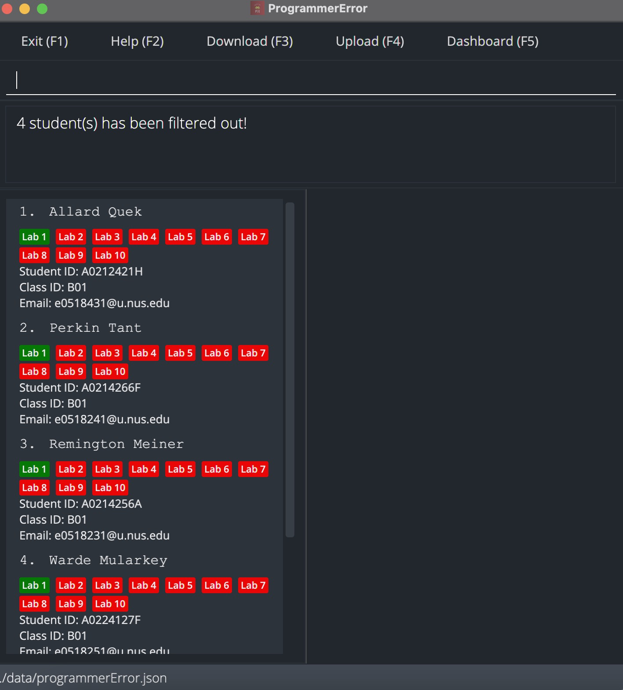
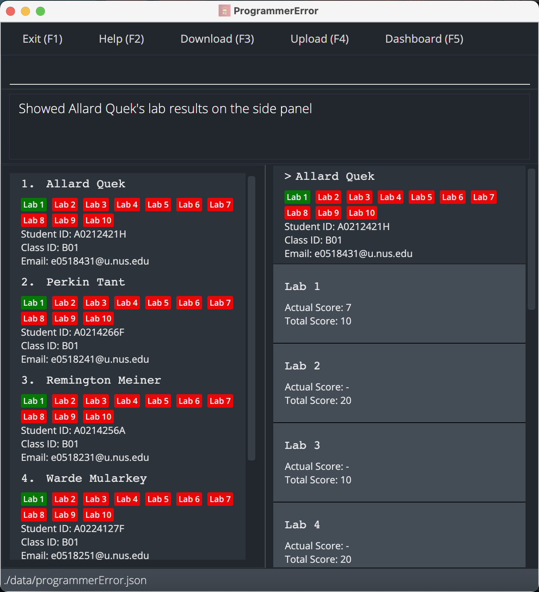

ProgrammerError (P|E) is a desktop app for managing students' information, optimized for use via a Command Line
Interface (CLI) while still having the benefits of a Graphical User Interface (GUI). Designed for CS2100 Lab TAs, this
application is optimized to track personal particulars, emails and lab results of your students across different
classes. If you are familiar with Unix commands, this is definitely for you!

## Table of Contents

- [Quick Start](#quick-start)
- [Features](#features)
  1. [General Features](#general-features)
        1. [View Help: `help`](#view-help)
        2. [View Dashboard `dashboard`](#view-dashboard)
        3. [Exit: `exit`](#exit)
  2. [Data Features](#data-features)
      1. [Fill Sample Data: `fill`](#fill-sample-data)
      2. [Purge All Data: `purge`](#purge-all-data)
      3. [Download Data: `download`](#download-data)
      4. [Upload Data: `upload`](#upload-data)
  3. [Student Features](#student-features)
      1. [Add Student: `add`](#add-student)
      2. [Edit Student Details: `edit`](#edit-student)
      3. [Delete Student: `delete`](#delete-student)
      4. [Filter Students: `filter`](#filter-student)
      5. [Show Student Details: `show`](#show-student)
      6. [List All Students: `list`](#list-students)
  4. [Lab Features](#lab-features)
      1. [Add Lab: `addlab`](#add-lab)
      2. [Edit Lab: `editlab`](#edit-lab)
      3. [Delete Lab: `dellab`](#delete-lab)
- [Command Summary](#command-summary)

## Quick Start

1. Ensure you have `Java 11` or above installed in your Computer.
2. Download the latest `programmerError.jar`
   from [here](https://github.com/AY2122S1-CS2103-F09-3/tp/releases).
3. Copy the file to the folder you want to use as the _home folder_ for your ProgrammerError.
4. Double-click the file to start the app. The GUI similar to the below should appear in a few seconds. Note how the app
   contains some sample data. 
   
5. Type the command in the command box and press Enter to execute it. For example, typing **`help`** and pressing Enter
   will open the help window. 
   Here are some example commands you can try:
    * `add -n Sherwin -sid A1234567X -cid B01 -email e0523451@u.nus.edu`: Adds a student named `Sherwin` to PE with his
      Student ID, Class ID and Email.
    * `edit 1 -n Sherwin`: Updates the name of the student at index 1 of the displayed list (1-indexed) to Sherwin
    * `delete 1`: Deletes the student at index 1 of the displayed list (1-indexed)
    * `filter -sid A1234567X`: Filters the list of students to display the student(s) whose student ID contains `
      A1234567X' (case-insensitive)
6. Refer to the [Features](#features) below for details on all available commands.
Take note that command parameters wrapped with `[` `]` listed in this guide signifies that the parameter is optional.

## Features

**Notes about the command format (Unix Command Syntax):**

- Similar to Unix CLI, the up and down arrow keys can be used to navigate the history of commands executed.
    - Up Arrow Key: Navigate to an older command.
    - Down Arrow Key: Navigate to a more recent command.
    - Command will only be stored after `Enter` has been pressed.
- Flags will be used to specify different options for the commands. For example, the `-sid` flag can be used to specify
  a student's student ID.
- Parameters can be in any order.   e.g. if the command specifies `-n NAME -sid STUDENT_ID`
  , `-sid STUDENT_ID -n NAME`is also acceptable.
- If a parameter is expected only once in the command, but you specified it multiple times, only the **last** occurrence
  of the parameter will be taken.   e.g. if you specify `-n Allard -n Xian Yi` , only `-n Xian Yi` will be taken.
- Extraneous parameters for commands that do not take in parameters (such as `help`, `exit` and `purge`) will be
  ignored. e.g. if the command specifies `help 123`, it will be interpreted as `help`.

## Parameter Summary

Parameter | What it means
--------| ----------------------
**-n** | Name of Student
**-sid** | Student ID of Student
**-cid** | Class ID of Student
**-email** | Email of Student
**-ln** | Lab Number
**-nln** | New Lab Number (used for `editlab` command only)
**-ts** | Lab Total Score
**-s** | Lab Score of Student

## 1. General Features

### 1.1 View Help: `help` or F2 on keyboard

Shows a message explaining how to access the help page.

### 1.2 Dashboard: `dashboard`

Displays a dashboard window showing the following data:

1. Number of students
2. Number of classes
3. Number of labs
4. Number of labs unmarked for each class

### 1.3 Exit: `exit` or F1 on keyboard

Exits ProgrammerError and closes the GUI.

## 2. Data Features

### 2.1 Fill Sample Data: `fill`

Fills the program with sample data if no data is already present. Otherwise, throws an error message.

:exclamation: **Note:**
As this is a mass operation, it might take a couple of seconds to complete.

### 2.2 Purge all Data: `purge`

Clears all data in PE. This can be used to delete pre-existing sample data or existing user data.

### 2.3 Download Data `download` or F3 on keyboard

All current students' data can be downloaded to a CSV file. The TA will need to select the directory to download the
file to.

### 2.4 Upload Data: `upload` or F4 on keyboard

Uploads student data via a CSV file with **only** the following fields: student ID, class ID, name, email

:exclamation: **Note:**
the CSV should *not* contain students' lab results since this functionality is only meant for the TA to automate the adding of students to PE.

- As such, simply uploading the CSV obtained via the `download` command will not be accepted
- Furthermore, if there are already existing students, the upload will **overwrite** the existing data rather than
  append to it. This is because in a typical use case, the TA would not want to have the existing data kept if they
  would like to use student data from their own CSV file.

In summary:

1. Select a valid CSV file from the file chooser to upload the student data from.
2. A valid CSV file must contain the following column header: `studentId,classId,name,email`
3. Note that this command is not meant for uploading lab results. Rather, it is only for automating the adding of
   students to PE.

## 3. Student Features

### 3.1 Add Student: `add`

Adds a student to ProgrammerError with their student ID and class ID. Both the student ID and class ID must be unique. 

Format: `add -n <NAME> -sid <STUDENT_ID> -cid <CLASS_ID> -email <EMAIL>`

💡 **Example:**

- `add -n Sherwin -sid A1234567X -cid B01 -email e0542421@u.nus.edu`: Adds the student called Sherwin with student ID
  A1234567X and class ID B01 and email e0542421@u.nus.edu to ProgrammerError.

### 3.2 Edit Student's Details or Grade : `edit`

Edits the details or grade of an existing student's in the PE.
Both the student ID and class ID must be unique. 1-indexing is used here as according to the displayed list.
Any combination of the optional arguments can be provided.
Take note that the parameters `-ln` and `-s` needs to be specified together.

Format: `edit <INDEX_IN_LIST> [-n <NAME>] [-sid <STUDENT_ID>] [-cid <CLASS_ID>] [-email <EMAIL>] [-ln <LAB_NUMBER> -s <ACTUAL_SCORE>]`

- Updates the student with at the given `INDEX_IN_LIST' with the arguments provided.
- Existing values will be updated to the input flag arguments.

💡 **Examples:**

- `edit 1 -n Elon Musk` Updates the name of the student at index 1 (1-indexed) to 'Elon Musk'.
- `edit 1 -ln 4 -s 29` Updates the lab 4 result of the student at index 1 (1-indexed) to 29.5.

### 3.3 Delete Student: `delete`

Deletes the specified student from the PE.

Format: `delete <STUDENT_INDEX>`

- Deletes the student at `<STUDENT_INDEX>`. (1-indexed)

💡 **Example:**

- `delete 23` Deletes the data of the student at index 23

### 3.4 Filter Students: `filter`

Filter the students in ProgrammerError based on the specified arguments provided (name, student ID, class ID and email).
Of the four arguments, at least one has to be provided. Arguments can be provided in any order and are
**case-insensitive**. ProgrammerError will display the filtered list of students whose details matches all the specified
arguments. The arguments are matched to the corresponding details as long as the details of the students contains the
sequence of characters provided in the argument string.

Format: `filter [-n <NAME>] [-sid <STUDENT_ID>] [-cid <CLASS_ID>] [-email <EMAIL>]`

💡 **Examples:**

- `filter -sid A1234567X` Lists all students whose student ID contains `A1234567X`.
- `filter -n abc` Lists all students whose name contains `abc`.
- `filter -cid B01` Lists all students whose class ID contains the character sequence `B01`.
- `filter -email e1234567` Lists all students whose email contains the character sequence `e1234567`.
- `filter -n Sherwin -cid B01` Lists all students whose name contains the character sequence `Sherwin` and belongs to a
  class with the class ID containing the character sequence `B01`.

### 3.5 Show Student Details: `show`

Shows a particular student's details including their scores for each lab.

The student particular and lab results will be updated if other commands modify their fields.

Format: `show <INDEX_IN_LIST>`

💡 **Example:**

- `show 1`: Shows the student particular and lab results of the student at index 1.

### 3.6 List All Students: `list`

Displays a list of all students in the left panel. This list is ordered first by class ID followed by student name.

## 4. Lab Features

:exclamation: **Note:**
As the following commands are mass operations, they might take slighty longer than usual.

### 4.1 Add Lab: `addlab`

Adds a lab to every student with the lab number and total score.

Format: `addlab -ln <LAB_NUM> -ts <TOTAL_SCORE>`

💡 **Examples:**

- `addlab -ln 1 -ts 20`: Adds a lab with number 1 and total score 20 for all students.
- `addlab -ln 2 -ts 30`: Adds a lab with number 2 and total score 30 for all students.

### 4.2 Edit Lab: `editlab`

Edits the details of an existing lab for every student.

Format: `editlab -ln <LAB_NUM> -nln <NEW_LAB_NUM> -ts <NEW_LAB_SCORE>`

💡 **Examples:**

- `editlab -ln 1 -ts 30`: Changes the total score of lab 1 to 30 for all students.
- `editlab -ln 1 -nln 2`: Changes the number of an existing lab from 1 to 2 for all students.

### 4.3 Delete Lab: `dellab`

Deletes an existing lab from every student in ProgrammerError.

Format: `dellab -ln <LAB_NUM>`

💡 **Example:**

- `dellab -ln 1`: Deletes lab 1 for all students if it exists.

## Command Summary

Command | Format & Examples
--------| ----------------------
**Add** | `add -n <NAME> -sid <STUDENT_ID> -cid <CLASS_ID> -email <EMAIL>`
**Add Lab** | `addlab -ln <LAB_NUM> -ts <TOTAL_SCORE>`
**Delete** | `delete <INDEX_IN_LIST>`
**Dashboard** | `dashboard`
**Delete Lab** | `dellab -ln <LAB_NUM>`
**Download** | `download`
**Edit** | Format 1:  `edit <INDEX_IN_LIST> -n <NAME> -sid <STUDENT_ID> -cid <CLASS_ID> -email <EMAIL>`   Format 2: `edit <INDEX_IN_LIST> -ln <LAB_NUMBER> -s <ACTUAL_SCORE>`
**Edit Lab** | `editlab -ln <LAB_NUM> -nln <NEW_LAB_NUM> -ts <NEW_LAB_SCORE>`
**Exit** | `exit`
**Fill** | `fill`
**Filter** | `filter -n <NAME> -sid <STUDENT_ID> -cid <CLASS_ID> -email <EMAIL>`
**Help** | `help`
**Purge** | `purge`
**Show** | `show <INDEX_IN_LIST>`
**Upload** | `upload`
